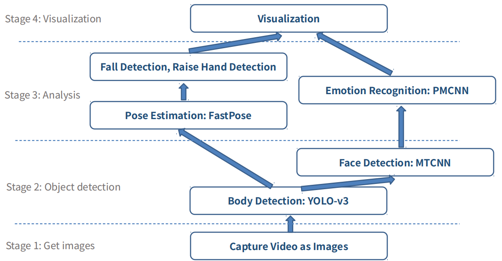
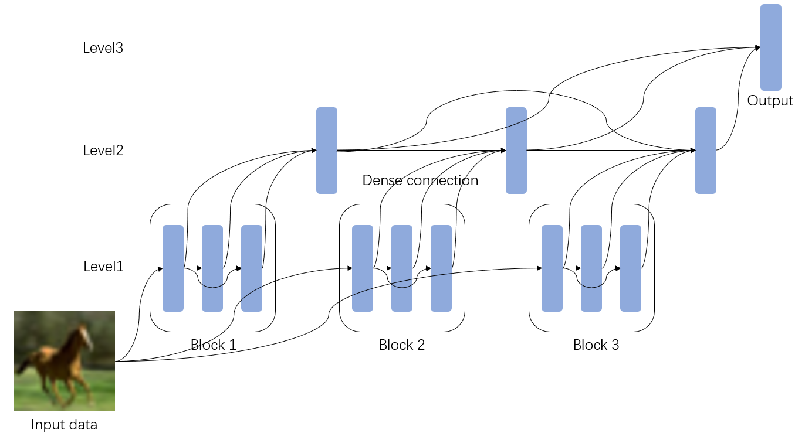
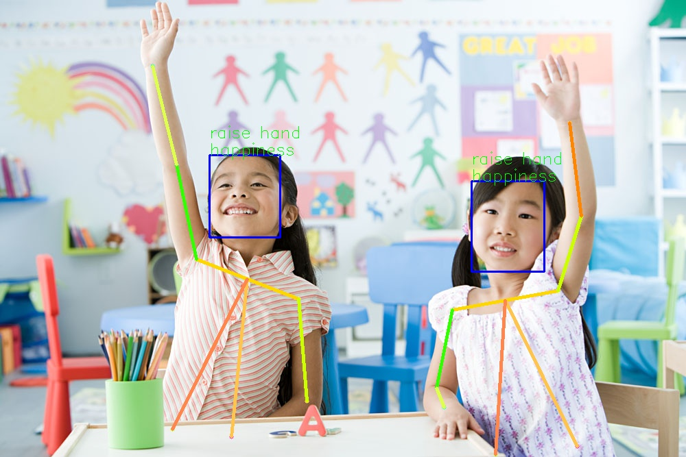
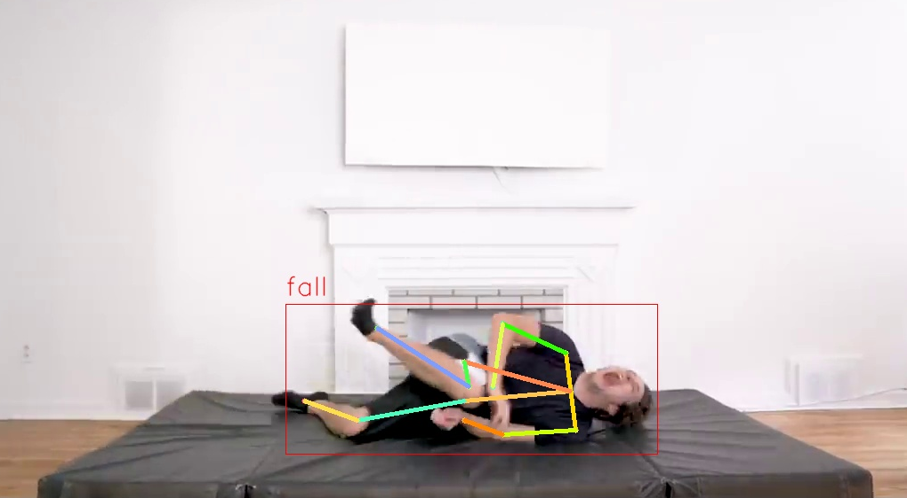

## 5014A_Pose and emotion analysis system
A comprehensive system with multiple functions: human detection, face detection, emotion recognition, pose estimation, hand-raising detection, and behavior analysis.

## Run demo
Run on webcam:
python main/main.py

Run on image:
python main/main.py --image 'path_to_image'

Run on video:
python main/main.py --video 'path_to_video'

## System framework

    

## Novel structure CNN

    

## Example
Hand-raising detection, emotion recognition:

    

Fall detection:

    

